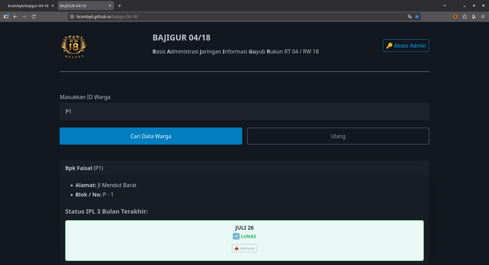
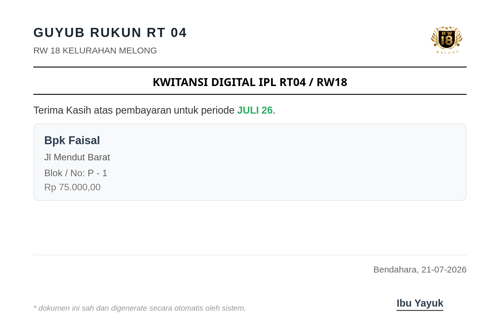
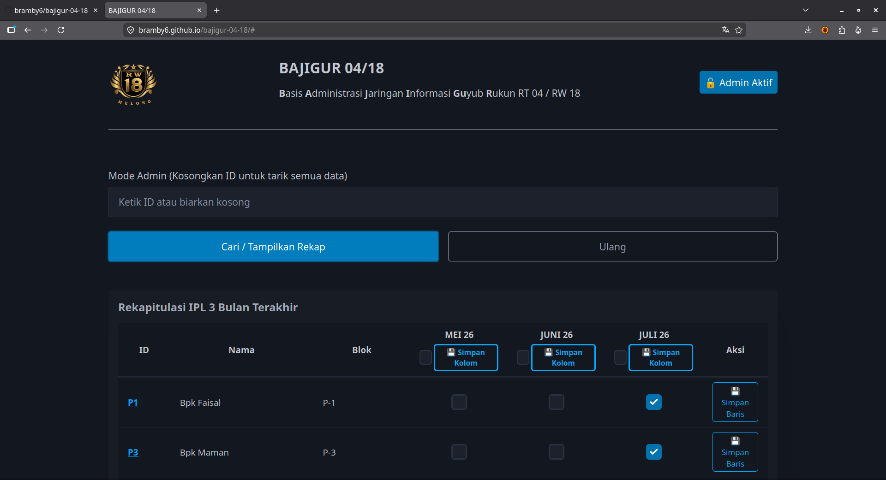

# ☕ BAJIGUR 04/18
**Basis Administrasi Jaringan Informasi Guyub Rukun RT 04 / RW 18**

Sistem manajemen pencatatan iuran warga (IPL), verifikasi pembayaran, dan pembuatan kwitansi digital berbasis web tanpa biaya server (100% Serverless & Gratis menggunakan **HTML + PicoCSS + Google Sheets + Google Apps Script**).

---

## 📸 Tangkapan Layar (Screenshots)

### 1. Halaman Warga (Single Search & Kwitansi Digital)

*Tampilan warga: memasukkan ID warga, melihat status IPL 3 bulan terakhir, dan men-download kwitansi digital (JPG) secara instan.*

### 2. Kwitansi Digital (jpg)


### 3. Halaman Admin Panel (Rekapitulasi IPL & Batch Save)

*Tampilan admin: rekapitulasi IPL 3 bulan terakhir seluruh warga, checkbox status bayar, fitur pencarian ID cepat, serta tombol simpan baris & simpan kolom.*

---

## ✨ Fitur-Fitur Utama

- **Mode Warga (Tanpa Login)**:
  - Pencarian status iuran cukup dengan memasukkan ID Warga (misal: `P1`, `A5`).
  - Menampilkan status IPL 3 bulan terakhir (LUNAS / BELUM).
  - Download kwitansi digital otomatis berformat JPG dengan tanda tangan stempel digital bendahara.
- **Mode Admin (Akses Pengurus)**:
  - Autentikasi aman menggunakan **OTP WhatsApp** (2-Factor via WhatsApp Gateway).
  - **Tabel Rekapitulasi**: Menampilkan seluruh data warga dan status pembayaran 3 bulan terakhir sekaligus.
  - **Quick ID Click**: Baris ID pada tabel dapat di-klik untuk berpindah langsung ke detail warga.
  - **Batch Save & Check All**: Tombol *Simpan Baris* per warga dan *Simpan Kolom* per bulan, serta checkbox *Pilih Semua* per bulan.
- **Biaya Operasional $0**:
  - Backend menggunakan **Google Apps Script (GAS)** REST API.
  - Database menggunakan **Google Sheets** (mudah di-edit langsung oleh bendahara/pengurus tanpa perlu keahlian basis data SQL).
  - Frontend murni HTML, JavaScript ES6, dan CSS PicoCSS (bisa di-host di GitHub Pages / Netlify / Vercel secara gratis).

---

## 🛠️ Arsitektur & Teknologi

- **Frontend**: HTML5, JavaScript (Vanilla ES6), [Pico CSS v2](https://picocss.com/)
- **Kwitansi Generator**: [html2canvas v1.4.1](https://html2canvas.hertzen.com/)
- **Backend API**: Google Apps Script (Web App `/exec`)
- **Database**: Google Sheets (Spreadsheet)
- **OTP Gateway**: Fonnte / WhatsApp Gateway API

---

## 🚀 Panduan Instalasi & Deploy

### 1. Persiapan Google Sheets & Apps Script
1. Buat salinan dari **[Template Contoh Google Spreadsheet BAJIGUR](https://docs.google.com/spreadsheets/d/1FpgQfFAhx3_m-tRHZ9bZPDDeiUP23HFBQXsy7dXeugI/edit?usp=drive_link)** (*File > Make a copy / Buat salinan*) ke Google Drive Anda.
2. Template ini sudah menyertakan struktur sheet data warga dan riwayat IPL per periode (misal `IPL_JULI_26`, `IPL_AGUSTUS_26`).
3. Buka **Extensions > Apps Script** pada Spreadsheet tersebut.
4. Paste kode Apps Script backend (`Code.gs`) yang menangani fungsionalitas `doGet` dan `doPost`.
5. Klik **Deploy > New Deployment**:
   - Select type: **Web App**
   - Execute as: **Me**
   - Who has access: **Anyone** (Set ke Anyone agar frontend bisa mengakses API).
6. Salin **Web App URL** (berakhiran `/exec`).

### 2. Konfigurasi Frontend
1. Buka file [config.js](file:///home/cakra/Documents/GitHub/bajigur-04-18/config.js) di project ini:
   ```javascript
   const CONFIG = {
     URL_API: "https://script.google.com/macros/s/YOUR_APPS_SCRIPT_ID/exec"
   };
   ```
2. Ganti `URL_API` dengan URL Web App Apps Script milik Anda.

### 3. Jalankan Aplikasi
Cukup buka [index.html](file:///home/cakra/Documents/GitHub/bajigur-04-18/index.html) langsung di browser, atau host di layanan static hosting gratis seperti **GitHub Pages**, **Vercel**, atau **Netlify**.

---

## 📡 Dokumentasi Endpoint API (Google Apps Script)

Base URL: `CONFIG.URL_API` (`https://script.google.com/macros/s/.../exec`)

### 1. `GET` Request

#### a. Ambil Semua Data Warga (Admin Rekap)
- **Query Parameter**: `?action=ambilSemuaDataWarga`
- **Response**:
  ```json
  {
    "status": "success",
    "data": {
      "periodeTigaBulan": ["IPL_MEI_26", "IPL_JUNI_26", "IPL_JULI_26"],
      "dataWarga": [
        {
          "ID": "P1",
          "Nama": "Budi Santoso",
          "Blok": "A",
          "Nomor": "05",
          "riwayatIPL": [
            { "periode": "IPL_JULI_26", "lunas": true }
          ]
        }
      ]
    }
  }
  ```

#### b. Cari Data Warga Single (Mode Warga)
- **Query Parameter**: `?action=cariDataWarga&id={ID_WARGA}`
- **Response**:
  ```json
  {
    "status": "success",
    "data": {
      "ID": "P1",
      "Nama": "Budi Santoso",
      "Alamat": "Jl. Merpati No. 12",
      "Blok": "A",
      "Nomor": "05",
      "riwayatIPL": [
        {
          "periode": "IPL_JULI_26",
          "nominal": 250000,
          "waktuBayar": "15 Juli 2026"
        }
      ]
    }
  }
  ```

#### c. Ambil Nama Bendahara
- **Query Parameter**: `?action=ambilNamaBendahara`
- **Response**:
  ```json
  {
    "status": "success",
    "data": "Ibu Yayuk"
  }
  ```

---

### 2. `POST` Request (JSON Body)

#### a. Request OTP Admin
- **Body**:
  ```json
  {
    "action": "requestOTP",
    "noWA": "628123456789"
  }
  ```

#### b. Verifikasi OTP Admin
- **Body**:
  ```json
  {
    "action": "verifyOTP",
    "pinInput": "1234"
  }
  ```

#### c. Simpan Perubahan IPL Per Baris / Single Warga
- **Body**:
  ```json
  {
    "action": "simpanPerubahanIPL",
    "idWarga": "P1",
    "namaWarga": "Budi Santoso",
    "statusPerBulan": {
      "IPL_JULI_26": true,
      "IPL_AGUSTUS_26": false
    }
  }
  ```

#### d. Simpan Perubahan IPL Per Kolom / Periode Bulan
- **Body**:
  ```json
  {
    "action": "simpanKolomIPL",
    "kodeSheet": "IPL_JULI_26",
    "data": [
      { "idWarga": "P1", "lunas": true },
      { "idWarga": "P2", "lunas": false }
    ]
  }
  ```

---

## 📄 Lisensi

MIT License - Bebas digunakan, dimodifikasi, dan didistribusikan untuk lingkungan RT/RW di seluruh Indonesia.
