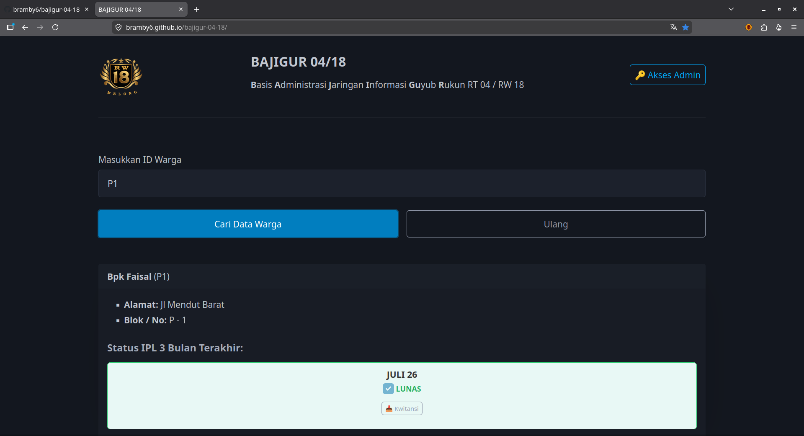
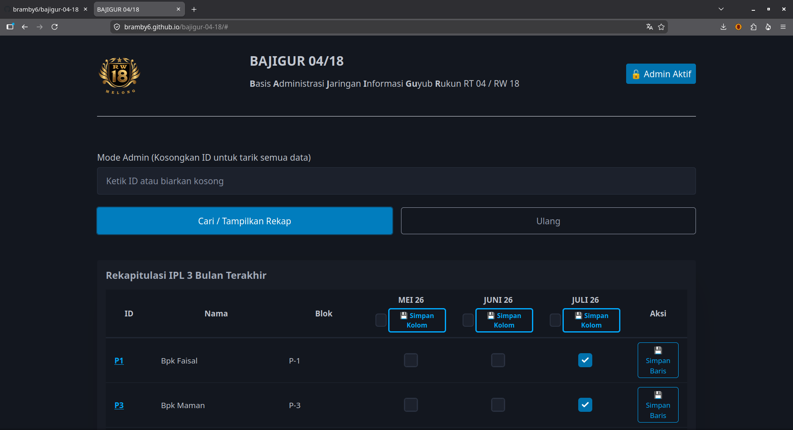
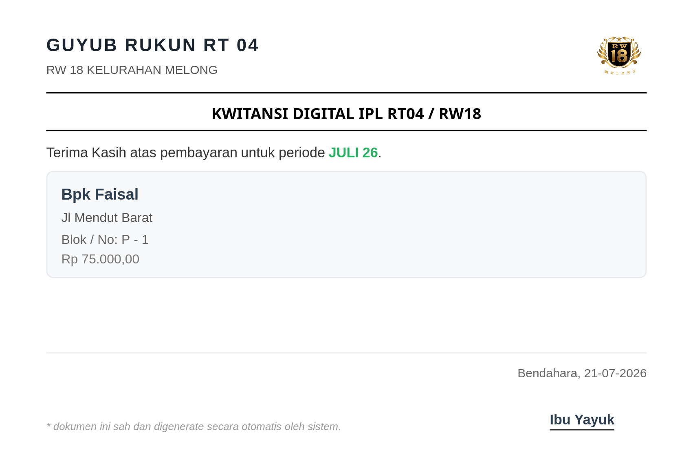

# ☕ BAJIGUR 04/18

## 📖 Ringkasan
Aplikasi web untuk mengelola pembayaran IPL (Iuran Pemeliharaan Lingkungan) komunitas perumahan. Front-end berupa satu file HTML (`index.html`) yang berkomunikasi dengan **Google Apps Script (GAS) Web App** sebagai back-end. Konfigurasi dimuat secara dinamis dari *Environment Properties* dan dipilih lewat pengenal `appID`.

---

## 📸 Cuplikan Layar (Screenshots)

### Tampilan Warga


### Tampilan Admin Panel


### Cetak Kwitansi Digital


---

## ⚙️ Persiapan Front-end
1. Buat atau edit file **`config.js`** dengan URL Web-App yang sudah di-deploy dan `APP_ID` rahasia Anda.
2. Tambahkan fungsi `request()` yang bertugas membungkus semua komunikasi ke server secara otomatis (sudah tersedia di file `config.js`).

---

## 📡 Endpoint API (Backend Logic)
Semua request menggunakan **Metode `POST`** dan header `Content-Type: text/plain`. Variabel `appID` otomatis disisipkan oleh fungsi `request()` di front-end.

### 1️⃣ `requestOTP`
- **Tujuan:** Mengirim kode OTP ke WhatsApp admin.
- **Payload:** `{ "appID": "...", "action": "requestOTP", "noWA": "628..." }`

### 2️⃣ `verifyOTP`
- **Tujuan:** Memverifikasi OTP yang diterima.
- **Payload:** `{ "appID": "...", "action": "verifyOTP", "pinInput": "1234" }`

### 3️⃣ `cariDataWarga`
- **Tujuan:** Mengambil data satu warga berdasarkan ID.
- **Payload:** `{ "appID": "...", "action": "cariDataWarga", "id": "XYZ" }`

### 4️⃣ `ambilSemuaDataWarga`
- **Tujuan:** Mengambil semua data warga untuk mode admin.
- **Payload:** `{ "appID": "...", "action": "ambilSemuaDataWarga" }`

### 5️⃣ `simpanPerubahanIPL`
- **Tujuan:** Menyimpan perubahan status pembayaran per warga.
- **Payload:** 
  ```json
  {
    "appID": "...",
    "action": "simpanPerubahanIPL",
    "idWarga": "P1",
    "namaWarga": "Budi",
    "statusPerBulan": { "IPL_JULI_26": true }
  }
  ```

### 6️⃣ `simpanKolomIPL`
- **Tujuan:** Update massal satu kolom (periode bulan) untuk banyak warga sekaligus.
- **Payload:** 
  ```json
  {
    "appID": "...",
    "action": "simpanKolomIPL",
    "kodeSheet": "IPL_JULI_26",
    "data": [ { "idWarga": "P1", "lunas": true } ]
  }
  ```

### 7️⃣ `ambilNamaBendahara`
- **Tujuan:** Mengambil nama bendahara yang tersimpan untuk cetak kuitansi.
- **Payload:** `{ "appID": "...", "action": "ambilNamaBendahara" }`

---

## 🚀 Menjalankan Front-end
1. Buka `index.html` di browser Anda.
2. Aplikasi akan memuat `config.js`. Fungsi `request()` akan otomatis menyisipkan `appID` ke dalam *payload* JSON di setiap interaksi dengan backend.
3. Semua fitur bekerja aman tanpa membocorkan parameter aksi di URL.

---

## 🧪 Pengujian & Validasi
- **Uji manual:** Buka halaman, klik menu *Akses Admin*, masukkan nomor WA, minta OTP, verifikasi, lalu cek apakah data warga dapat diambil dan disimpan.
- **Pastikan `Code.gs` (Backend) sudah diperbarui:** Backend harus membaca data menggunakan `JSON.parse(e.postData.contents)` pada fungsi `doPost(e)`.

---

## 📚 Catatan Penting
- **Keamanan Rahasia:** Kredensial seperti `TOKEN_FONNTE` dan ID Spreadsheet wajib tetap berada di *Script Properties* backend GAS. **Jangan pernah** memasukkannya ke `config.js` atau sisi front-end lainnya.
- **Kemudahan Skala & Hosting:** Front-end hanya membutuhkan URL Web-App GAS dan `APP_ID`. Aplikasi ini dapat di-host dengan mulus di Github Pages, Vercel, Netlify, atau dijalankan secara lokal.
- **Mengapa Semua Request Dibuat POST? (Bypass CORS):** Google Apps Script (GAS) memiliki batasan keamanan (CORS) yang ketat dan akan menolak *Preflight Request* (`OPTIONS`) secara default. Mengirim *custom headers* atau menggunakan `application/json` akan memicu penolakan tersebut. Solusinya: Semua komunikasi (termasuk GET data) diubah menjadi metode `POST` dengan `Content-Type: text/plain`, dan variabel disisipkan ke dalam *Body Payload* JSON. Ini membuat API 100% bebas dari error CORS.